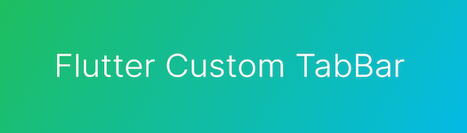

<!--
This README describes the package. If you publish this package to pub.dev,
this README's contents appear on the landing page for your package.

For information about how to write a good package README, see the guide for
[writing package pages](https://dart.dev/guides/libraries/writing-package-pages).

For general information about developing packages, see the Dart guide for
[creating packages](https://dart.dev/guides/libraries/create-library-packages)
and the Flutter guide for
[developing packages and plugins](https://flutter.dev/developing-packages).
-->



## Features

- Smooth animations and gestures
- Scrollable tabs
- Fully Customized TabBar Cell
- Highly customizable

## Usage

To start using TabBarPage you have to create first page list and create instance of TabPageController.

```dart
List<PageTabItemModel> lstPages = <PageTabItemModel>[];
final TabPageController _controller = TabPageController();

@override
void initState() {
  super.initState();
  lstPages.add(PageTabItemModel(title: "Tab1", page: Container(color: Colors.deepOrangeAccent)));
  lstPages.add(PageTabItemModel(title: "Tab2", page: Container(color: Colors.indigoAccent)));
  lstPages.add(PageTabItemModel(title: "Tab3", page: Container(color: Colors.tealAccent)));
}
```

After that add TabBarPage Widget

```dart
 @override
Widget build(BuildContext context) {
  return Scaffold(
    appBar: AppBar(
      title: const Text("Sample"),
    ),
    body: Column(
      children: <Widget>[
        Flexible(
          child: TabBarPage(
            controller: _controller,
            pages: lstPages,
            isSwipable: true,
            tabBackgroundColor: Colors.yellow,
            tabitemBuilder: (context, index) {
              return InkWell(
                onTap: () {
                  _controller.onTabTap(index);
                },
                child: SizedBox(
                  width: MediaQuery.of(context).size.width / lstPages.length,
                  child: Center(
                    child: Text(
                      lstPages[index].title ?? "",
                      style: TextStyle(
                          color: _controller.currentIndex == index ? Colors.black : Colors.black26, fontSize: 16),
                    ),
                  ),
                ),
              );
            },
          ),
        )
      ],
    ),
  );
}
```
